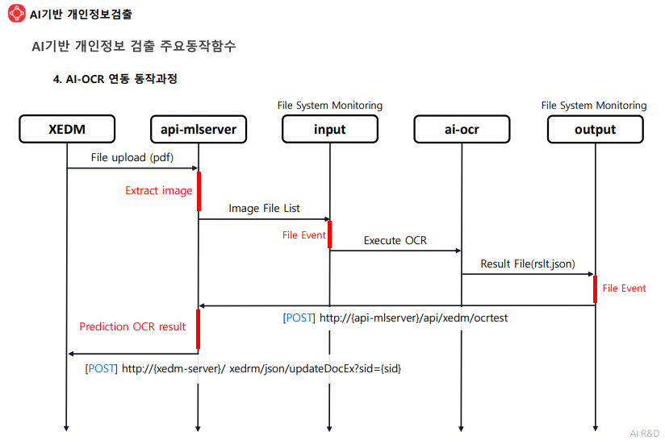

## XEDM PID Server

## BUILD

#### normal
``` docker-compose up --build ```

#### env
``` docker-compose up --build --env_file=.env ```

## Machine Learning Model Files

### IDC Config
```
IP: 183.111.96.29
PORT: 22
USER: aimanager
PW: dlswpsxm1!1
Model PATH: /home/aimanager
```

### Download
```
# ./project_folder
dvc remote add --default ssh-storage ssh://183.111.96.29/home/aimanager
dvc remote modify ssh-storage user aimanager
dvc remote modify ssh-storage port 22
dvc remote modify --local ssh-storage password 'dlswpsxm1!1'
dvc pull
```


## Config

### 필요한 파일 목록

#### api-mlserver
- ```common/const.py```: API Server Config file

#### api-aiocr
- /model/emptycell/emptycell.ckpt/saved_model.pb
- /model/emptycell/emptycell.ckpt/variables.data-00000-of-00001
- /model/emptycell/emptycell.ckpt/variables.index
- /model/prepad/prepad
- h2o-3.34.0.3-py2.py3-none-any.whl

#### Container간 Volume 공유 폴더
``` /ocr_work/input ``` : ```api-mlserver```에서 pdf to img 결과 저장  
``` /ocr_work/input ``` : ```api-aiocr```에서 img to data 결과 저장


## DVC(Data Version Control)
Machine Learning Model File을 저장 및 관리하기 위한 라이브러리

### 사용방법
#### 설치  
```pip install dvc```

#### 초기화  
```dvc init```


### Local

##### 연결  
>```dvc remote add -d [DATA_DIR] [SAVE_FOLDER_DIR] ```  
>```[DATA_DIR]```에 모델파일(.pd, .ckpt ... ) 저장  

##### 파일 등록
>```dvc add [DATA_DIR]```  

##### 파일 업로드  
>```dvc push```  
>push후 프로젝트 폴더에 [SAVE_FOLDER_DIR] 가 생성되고, 이 안에 md5 형태로 데이터 저장  

##### 파일 다운로드
>```dvc pull```  
> ```[DATA_DIR]``` 폴더의 내용이 지워지더라도 dvc pull 로 다운로드


### SSH

##### 연결
>```dvc remote add --default ssh-storage ssh://[HOST_ADDRESS]/[PATH]```

##### 사용자 설정
> ```dvc remote modify ssh-storage user aimanager```  

##### 포트 설정
> ```dvc remote modify ssh-storage port 22```

##### 사용자 패스워드
> ```dvc remote modify --local ssh-storage password [PASSWORD]```

##### 파일 등록
>```dvc add [DATA_DIR]```  

##### 파일 업로드  
>```dvc push```  

## OCR 연동
```api-aiocr``` : docker - volume 활용
조건: 두개의 worker를 띄워야 함. 추후 ```Celery```로 처리 필요.

### worker 실행
>```
>python [Project]/ocr_work/input/watchdogs.py
>python [Project]/ocr_work/output/watchdogs.py
>```

##### input/watchdogs.py
> ```input``` 폴더에 PDF 파일에서 추출된 이미지가 저장되면 해당 이미지를 읽어 OCR 요청

##### output/watchdogs.py
> ```output```폴더에 OCR결과값(```rlst.json```)이 저장되면 해당 파일을 읽어 ```api-mlserver```에 개인정보검출 요청

### 동작 과정
